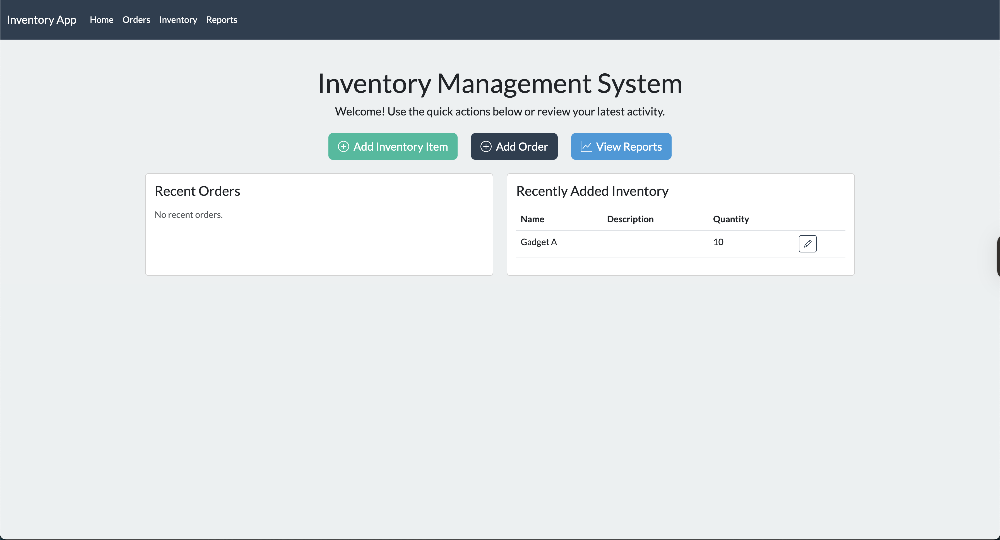

# Inventory Management System

[](https://render.com/deploy)

A simple, teaching-friendly web application for managing inventory in a small retail business. Built with Flask, Jinja, Bootstrap 5, and Flask-SQLAlchemy.

## Features

- Full CRUD for inventory items (add, edit, delete, view)
- Full CRUD for orders (add, edit, delete, view), including dynamic forms for multiple items per order
- Dashboard with quick actions, recent orders, and recent inventory items
- Low stock and nearing-low stock alerts
- Detailed reports:
  - Inventory Valuation
  - Sales Summary (by date)
  - Low Stock Report
- Flash messages for user feedback
- Consistent, modern Bootstrap 5 UI with icons
- PostgreSQL or SQLite backend (auto-detects based on environment)

## Tech Stack

- Python 3
- Flask (with Jinja templating)
- Bootstrap 5 (via CDN)
- PostgreSQL (preferred) or SQLite (via Flask-SQLAlchemy)

## Database Diagram


## Setup

1. Create and activate a virtual environment:
   ```bash
   python -m venv venv
   source venv/bin/activate
   ```
2. Install dependencies:
   ```bash
   pip install -r requirements.txt
   ```
3. Run the app:

   ```bash
   flask run
   # or
   python app.py
   ```

4. Open your browser to [http://localhost:5000](http://localhost:5000)

## Project Structure

- `app.py` – Main Flask application and routes
- `models.py` – Database models
- `requirements.txt` – Python dependencies
- `Procfile` – For Render.com deployment
- `sample_data.sql` – Sample data for quick start
- `templates/` – Jinja HTML templates
  - `base.html` – Shared base template
  - `dashboard.html` – Home/dashboard with quick actions and recent activity
  - `inventory.html`, `add_inventory_item.html`, `edit_inventory_item.html` – Inventory management
  - `orders.html`, `add_order.html`, `edit_order.html`, `order_detail.html` – Order management
  - `reports.html`, `inventory_valuation_report.html`, `sales_summary_report.html`, `low_stock_report.html` – Reporting
- `static/` – Static files (CSS, JS, images)
- `.env.EXAMPLE` – Example environment configuration

## Commit Philosophy

Each commit represents a clear, teachable step in the project-building process, with descriptive messages and comments to help learners follow along.

---

## Screenshots

### Dashboard



### Inventory Page


### Orders Page


### Reports Page


## Sample Data

You can quickly populate your database for demo/testing with:

```bash
psql $DATABASE_URL < sample_data.sql
```

## Contributing

Pull requests and suggestions welcome! Please open an issue or submit a PR.

## License

MIT License. See [LICENSE](LICENSE) for details.

## 🚀 Deploying to Render.com

You can deploy this app to Render with one click using the badge above, or manually by following these steps:

1. **Fork or clone this repository.**
2. **Click the Deploy to Render badge above** (or go to [https://render.com/deploy](https://render.com/deploy)) and connect your GitHub repo.
3. **Set environment variables:**
   - `DATABASE_URL` (Render provides this if you add a PostgreSQL instance)
   - `SECRET_KEY` (set your own secure value)
   - `FLASK_ENV=production`
4. **(Optional) Add a PostgreSQL database** via Render’s dashboard and connect it to your service.
5. **Build and start commands:**
   - Build command: `pip install -r requirements.txt`
   - Start command: `gunicorn app:app`
6. **Wait for deployment to finish, then visit your Render URL!**

---

_Built as a demonstration for instructional evaluation._
