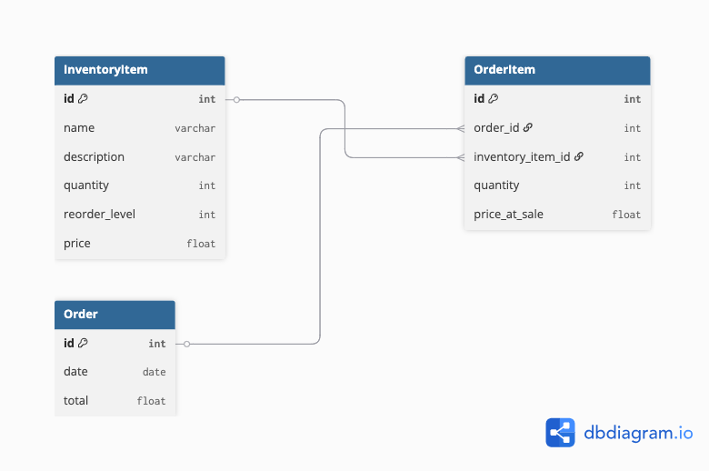

# Inventory Management System

A simple, teaching-friendly web application for managing inventory in a small retail business. Built with Flask, Jinja, Bootstrap 5, and Flask-SQLAlchemy.

## Features

- Full CRUD for inventory items (add, edit, delete, view)
- Full CRUD for orders (add, edit, delete, view), including dynamic forms for multiple items per order
- Dashboard with quick actions, recent orders, and recent inventory items
- Low stock and nearing-low stock alerts
- Detailed reports:
  - Inventory Valuation
  - Sales Summary (by date)
  - Low Stock Report
- Flash messages for user feedback
- Consistent, modern Bootstrap 5 UI with icons
- PostgreSQL or SQLite backend (auto-detects based on environment)

## Tech Stack

- Python 3
- Flask (with Jinja templating)
- Bootstrap 5 (via CDN)
- PostgreSQL (preferred) or SQLite (via Flask-SQLAlchemy)

## Database Diagram



## Setup

1. Create and activate a virtual environment:
   ```bash
   python3 -m venv venv
   source venv/bin/activate
   ```
2. Install dependencies:
   ```bash
   pip install -r requirements.txt
   ```
3. Run the app:

   ```bash
   flask run
   # or
   python app.py
   ```

4. Open your browser to [http://localhost:5000](http://localhost:5000)

## Project Structure

- `app.py` – Main Flask application and routes
- `models.py` – Database models
- `templates/` – Jinja HTML templates
  - `dashboard.html` – Home page with quick actions and recent activity
  - `inventory.html`, `orders.html` – Inventory and order management
  - `reports.html`, `inventory_valuation_report.html`, `sales_summary_report.html`, `low_stock_report.html` – Reporting
- `static/` – Static files (CSS, JS, images)
- `.env.EXAMPLE` – Example environment configuration

## Commit Philosophy

Each commit represents a clear, teachable step in the project-building process, with descriptive messages and comments to help learners follow along.

---

_Built as a demonstration for instructional evaluation._
